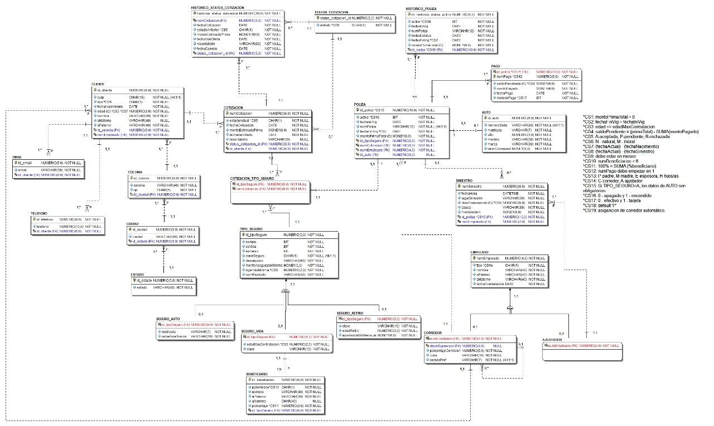

# 🏢 Sistema de Base de Datos - Aseguradora "El Buen Retiro"

Este repositorio contiene el diseño e implementación completa de una base de datos relacional para la gestión integral de una compañía de seguros. El proyecto abarca desde el modelado de datos hasta la implementación de reglas de negocio complejas mediante Triggers, seguridad basada en roles y generación de informes estadísticos.

## 📋 Descripción del Proyecto

El sistema está diseñado para administrar el ciclo de vida completo de productos de seguros (Auto, Vida y Retiro), gestionando:
* **Cartera de Clientes:** Personas físicas y morales.
* **Fuerza de Ventas:** Corredores, Ajustadores y Jerarquías de supervisión.
* **Ciclo de Venta:** Desde la cotización hasta la emisión de la póliza.
* **Finanzas:** Control de pagos, saldos pendientes y cálculo de rentabilidad.
* **Siniestralidad:** Registro y seguimiento de siniestros por ajustadores.

## 🛠️ Arquitectura de la Base de Datos

La base de datos `SEGUROS` está organizada en **Esquemas** para garantizar la modularidad y seguridad:

| Esquema | Descripción |
| :--- | :--- |
| **`CLIENTE`** | Datos demográficos, ubicación (INEGI) y contacto de los asegurados. |
| **`TRABAJADOR`** | Gestión de empleados, diferenciando entre Corredores (Ventas) y Ajustadores (Siniestros). |
| **`COTIZACION`** | Histórico y estado de las propuestas comerciales antes de convertirse en pólizas. |
| **`SEGURO`** | Catálogo de productos y reglas específicas (Coberturas, Edades máximas, Aportaciones). |
| **`POLIZA`** | Contratos activos, control de pagos, vigencias y siniestros asociados. |

## 🚀 Características Técnicas Destacadas

### 1. Reglas de Negocio Complejas (Triggers)
Se implementaron **Consideraciones Semánticas (CS)** mediante Triggers para validar lógica que `CHECK` constraints no pueden cubrir:
* **CS3 - Validación de Edad (Vida):** Impide contratar seguros de vida si el cliente supera la edad máxima permitida por el producto.
* **CS4 - Recálculo Financiero:** Trigger que actualiza automáticamente el `saldoPendiente` de una póliza cada vez que se registra o elimina un pago.
* **CS10 & CS11 - Beneficiarios:** Valida que un seguro de vida tenga máximo 5 beneficiarios y que la suma de sus porcentajes sea **estrictamente 100%**.
* **CS15 - Integridad de Producto:** Asegura que una póliza de tipo "Auto" tenga obligatoriamente un vehículo asociado.
* **CS19 - Asignación Automática:** Trigger `INSTEAD OF INSERT` que asigna automáticamente un Corredor al cliente basándose en su código postal (Zona).

### 2. Programación T-SQL
* **Stored Procedures:** Para operaciones transaccionales seguras (Alta de clientes, Registro de siniestros, Renovaciones).
* **Funciones Escalares y Tabulares:** Cálculo de comisiones por corredor, riesgo del cliente y rentabilidad por póliza.
* **Vistas:** Reportes pre-construidos para análisis de desempeño y estados de cuenta.

### 3. Seguridad (RBAC)
Implementación de un esquema de seguridad robusto en `Seguridad.sql`:
* **Roles:** `Administrador`, `Gerente`, `Jefe_Comercial`, `Jefe_Agencia`, `Asesor`, `Cliente`.
* **Principios:** Asignación de permisos granulares (`GRANT SELECT`, `EXECUTE`) sobre esquemas y objetos específicos, protegiendo la data sensible.

## 📂 Estructura del Repositorio

* `CreaBase.sql`: Script DDL. Crea la BD, esquemas, tablas, constraints y Triggers.
* `CargaInicial.sql`: Script de población de datos (Seed data) para pruebas inmediatas.
* `dml.sql`: Definición de Stored Procedures y Funciones (Lógica de negocio).
* `Informes(estadisticas).sql`: Vistas y procedimientos para reportes gerenciales.
* `Seguridad.sql`: Configuración de Logins, Usuarios y Permisos.
* `ValidaTriggers.sql`: Suite de pruebas unitarias para verificar el funcionamiento de los triggers (Casos de éxito y fallo).
* `ModeloAseguradora.jpeg`: Diagrama Entidad-Relación (DER) del proyecto.

## ⚙️ Instalación y Despliegue

Para desplegar este proyecto en SQL Server 2022:

1.  **Crear Estructura:** Ejecutar `CreaBase.sql`.
2.  **Cargar Lógica:** Ejecutar `dml.sql` y `Informes(estadisticas).sql`.
3.  **Poblar Datos:** Ejecutar `CargaInicial.sql`.
4.  **Configurar Seguridad:** Ejecutar `Seguridad.sql` (Requiere permisos de `sysadmin`).
5.  **Pruebas:** Ejecutar `ValidaTriggers.sql` para confirmar que las reglas de negocio están activas.

## 📊 Modelo Relacional

